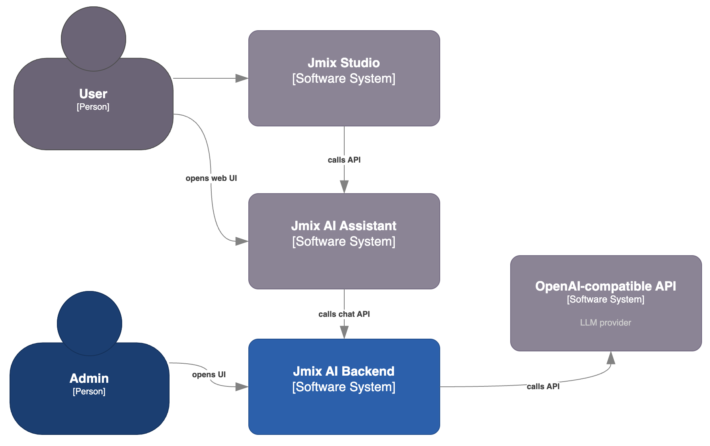
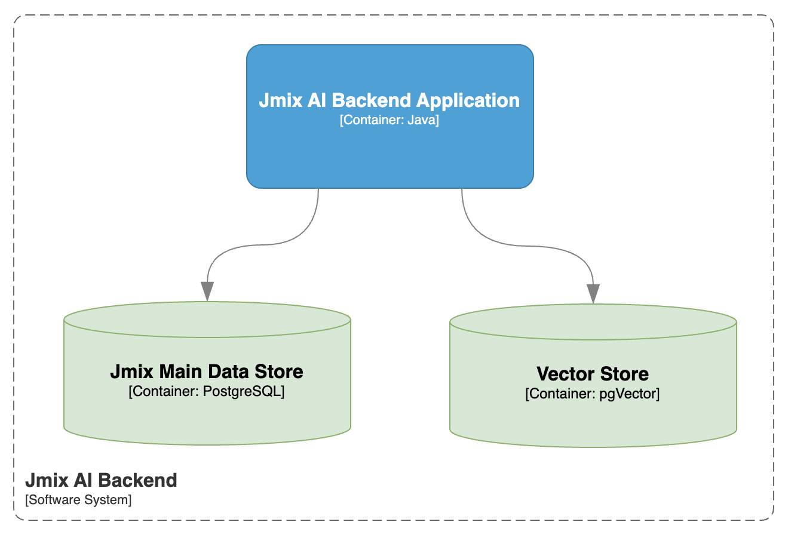

# Jmix AI Backend

Jmix + Spring AI backend for RAG-based assistant scenarios.

The application provides:
- REST APIs for chat and semantic search,
- an admin UI to manage knowledge bases, sources, parameters, and checks,
- ingestion into pgvector,
- reranking via a sidecar Python service,
- answer quality checks,
- business-documents mode for narrow deterministic use cases.

For onboarding, start here: [`START_HERE.md`](START_HERE.md)

## Architecture



Main runtime components:
- `jmix-ai-backend` (Spring Boot + Jmix)
- `postgres` (main store)
- `pgvector` (vector store)
- `reranker` (FastAPI service)
- OpenAI-compatible model endpoint (LM Studio, Ollama-compatible gateway, etc.)



## Key Capabilities

### 1) Chat API and UI

- API: `POST /chat`
- UI: `http://localhost:8081`
- Active chat behavior is driven by `Parameters` (YAML content in DB).

### 2) Semantic Search API

- API: `POST /api/search`
- Uses retrieval pipeline and vector store content.

### 3) Retrieval Tools

Depending on active profile, the system can use:
- `documentation_retriever`
- `framework_retriever`
- `uisamples_retriever`
- `trainings_retriever`
- `business_documents_retriever`

### 4) Chat Modes (profile-driven)

Seeded on startup from:
- `io/jmix/ai/backend/init/default-params-chat.yml` (`classifier_rag`)
- `io/jmix/ai/backend/init/default-params-chat-always-rag.yml` (`always_rag`)
- `io/jmix/ai/backend/init/default-params-chat-narrow-rag.yml` (`narrow_rag`)

`narrow_rag` is intended for business-document scenarios.

### 5) Answer Checks

UI flows for check definitions, runs, and run comparison are available under the **Answer Checks** menu.

## Quick Start (Local)

### Prerequisites

- Docker + Docker Compose
- JDK 17+ (JDK 21 recommended)
- running OpenAI-compatible endpoint at `http://localhost:6666`

Detailed requirements: [`docs/REQUIREMENTS.md`](docs/REQUIREMENTS.md)

### 1) Start infrastructure

```bash
docker-compose up -d
```

### 2) Start backend

```bash
./gradlew bootRun
```

### 3) Open UI

- URL: `http://localhost:8081`
- default dev credentials: `admin / admin`

### 4) Run smoke request

```bash
curl -sS -X POST http://127.0.0.1:8081/chat \
  -H 'Content-Type: application/json' \
  -d '{"conversation_id":"smoke-1","text":"What is DataManager in Jmix?"}'
```

Operational commands and troubleshooting: [`docs/RUNBOOK.md`](docs/RUNBOOK.md)

## Configuration

Main files:
- `src/main/resources/application.properties`
- `src/main/resources/application-dev.properties`

Default local ports:
- `8081` app
- `15432` main Postgres
- `15433` pgvector
- `8000` reranker
- `6666` OpenAI-compatible endpoint for chat and embeddings

## Admin UI Areas

Menu highlights:
- Chat + Chat Log
- Knowledge: Knowledge Bases, Knowledge Sources, Ingestion Jobs
- Config: Parameters, Vector Store, Entity Inspector
- Answer Checks: Definitions, Runs, Comparison
- Security: Users and roles

## API Summary

### `POST /chat`

Request:
```json
{
  "conversation_id": "test-1",
  "text": "How to create a lookup screen in Jmix 1.7?",
  "cache_enabled": true
}
```

Response contains:
- `input`
- `output`
- `query_category`
- `sources`

### `POST /api/search`

Request:
```json
{
  "query": "DataManager"
}
```

Response is a list of search result documents.

## Reranker Service

Local standalone run (if not using Docker Compose):

```bash
cd reranker
python3.10 -m venv env
source env/bin/activate
pip install -r requirements.txt
uvicorn reranker_service:app --host 0.0.0.0 --port 8000
```

## Build

Build app image:

```bash
./gradlew bootBuildImage -Pvaadin.productionMode=true
```

Build reranker image:

```bash
docker build -t jmix-ai-reranker ./reranker
```
