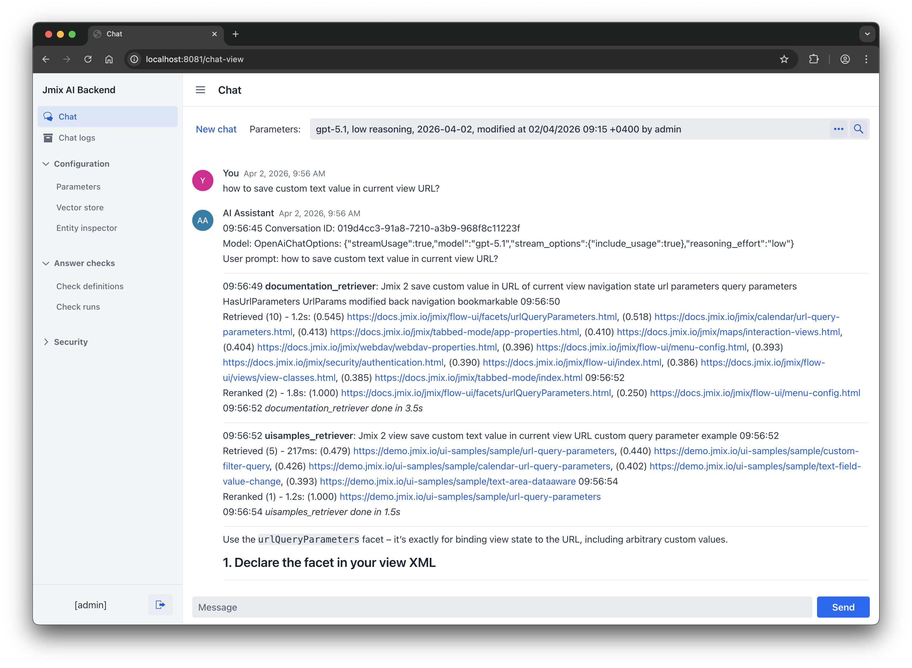
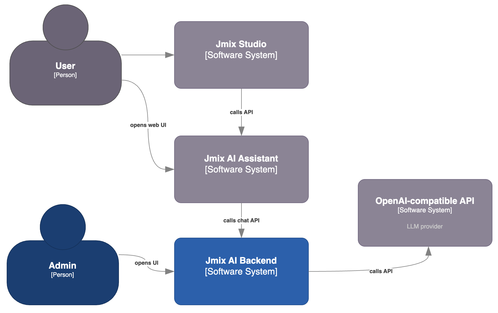
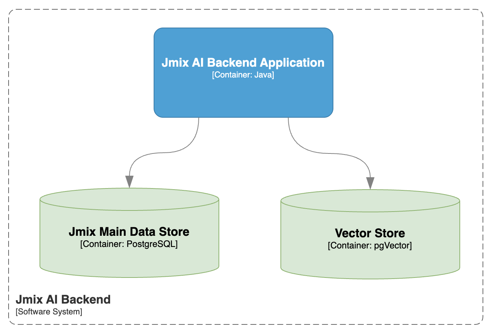

# Jmix AI Backend

AI-powered backend service designed to answer questions about the Jmix framework using Retrieval Augmented Generation (RAG). It's built with Spring AI and Jmix itself. 

The service provides a chat API and an admin UI for managing the knowledge base and LLM parameters. It integrates with OpenAI models, PgVector for vector storage, and includes custom reranking and answer validation logic.



## Architecture

The Jmix AI Backend system is designed to be used as a backend service for the Jmix AI Assistant, which provides web UI for users and an API for Jmix Studio.

However, Jmix AI Backend provides its own UI for administrators. 



Jmix AI Backend application uses PgVector for vector storage and a PostgreSQL database for parameters, chat history and answer checks.



## Features

### Chat

It answers questions about the Jmix framework using Retrieval Augmented Generation (RAG). The chat is available through the API and the admin UI. 

The main chat functionality is implemented in the `ChatImpl` Spring bean. Its retrieval tools are `DocsTool`, `UiSamplesTool`, `TrainingsTool` and `JavaApiTool`; each can be enabled or disabled in the active parameters. Each tool retrieves information from the vector store according to the LLM's requests.

After retrieving documents from the vector store, each tool filters them using a post-retrieval filtering algorithm and applies a reranking algorithm to the remaining documents. The reranked documents are then passed to the LLM.

The OpenAI API key should be defined in the `OPENAI_API_KEY` environment variable or otherwise provided in the `spring.ai.openai.api-key` application property.

### Post-retrieval filtering

The retrieved documents are filtered using a set of Groovy scripts that are applied to each document. The filtering is performed using the `PostRetrievalProcessor` class.

### Reranker

The reranker uses an OpenAI chat model to score candidate documents and reorder them before they are passed to the answering model. It uses the same API key as the main chat LLM.

### Ingesters

Ingesters are used to import documents into the vector store. Except for `TrainingsIngester`, each ingester builds a separate corpus for every supported Jmix version (`v2`, `v3`) from version-specific source URLs (`docs.v2.base-url`, `docs.v3.base-url`, etc.). The application includes the following ingesters:
- `DocsIngester`: loads information from the Jmix documentation. This ingester is configured by the `docs.*` application properties.
- `UiSamplesIngester`: loads information from the Jmix UI Samples online application. This ingester is configured by the `uisamples.*` application properties.
- `TrainingsIngester`: loads information from the Jmix training courses. This ingester is configured by the `trainings.*` application properties. While the training courses content is not available to the public, you can provide your own set of AsciiDoc files.
- `JavaApiIngester`: loads Java API reference from the Jmix Javadoc site and formats each class page as a compact "API card" snippet with verbatim signatures — the deterministic `javaapi` corpus, built without LLM calls. `JavaApiEnrichedIngester` builds the parallel `javaapi-enriched` corpus of the same cards where an LLM additionally generates a description and a usage example; generated content is cached in the database by source hash, so unchanged pages are not re-generated. The default parameters point the `javaapi_retriever` tool at `javaapi-enriched`; the `tools.javaapi_retriever.vectorType` parameter switches it back to the plain corpus. Only versions with a configured Javadoc base URL are ingested. Configured by the `javaapi.*` application properties.
- `DocsSnippetsIngester` and `UiSamplesSnippetsIngester`: separate corpuses (`docs-snippets`, `uisamples-snippets`) that coexist in the vector store with the raw `docs` and `uisamples` corpuses and are updated independently. The same source pages are converted into small context7-like snippets by an LLM, plus lossless plain-text coverage chunks of each page — retrieval returns both. Generation is cached like the Java API enrichment and configured by the `snippets.enrichment.*` properties. The default chat/search parameters already point the retrieval tools at these corpuses; the `tools.<name>.vectorType` parameter switches a tool back to a raw corpus (`docs`, `uisamples`).

All ingesters implement the `Ingester` interface and are invoked through the `IngesterManager` Spring bean.  

### Chat parameters

The chat parameters are stored in the database using the `Parameters` entity. They are used by the application through the `ParametersRepository` interface. 

The `Parameters` instance includes the YAML configuration that specifies parameters for the LLM, reranker, tools and post-retrieval filtering. You can create multiple instances of the `Parameters` entity and use them for different chat sessions to test different configurations. One instance should be marked as active to be used in the API calls.

### Answer checks

This feature allows you to quickly validate AI response quality after changing the chat parameters. It uses a separate LLM to calculate the semantic score for similarity between the question and the answer. The LLM is called through OpenAI API and configured by `answer-checks.model` and `answer-checks.temperature` application properties. It uses the same API key as the main chat LLM.

## Chat API

The chat API available at `http://localhost:8081/chat` URL is the main entry point to the application functionality. It is provided by the `ChatController` class which delegates to the `Chat` interface implemented by `ChatImpl` Spring bean.

Example request:
```
POST /chat HTTP/1.1
Host: localhost:8081
Content-Type: application/json

{
    "conversation_id": "test-988979",
    "text": "How can I create a button that triggers a notification when clicked?",
    "cache_enabled": true,
    "jmix_version": "v2"
}
```

The `cache_enabled` property is currently not used.

The optional `jmix_version` property (`v2` or `v3`) selects the documentation corpus and the version
mentioned in the system prompt; it defaults to `v2`.

## Search API

The `POST /api/search` endpoint keeps the original response contract for existing clients. It accepts
`query` and the optional `jmix_version` (`v2` or `v3`, default `v2`) and returns `id`, `title` and
`content` fields in the legacy format: a response-local generated ID, the full document text as the
title and Spring AI formatted content.

The `POST /api/v2/search` endpoint runs the retrieval tools without the answering LLM and returns
context7-like snippets ordered by relevance across all tools:

```
POST /api/v2/search HTTP/1.1
Content-Type: application/json

{
    "query": "how to add a click handler to a button",
    "jmix_version": "v2",
    "tokens": 2000,
    "max_results": 10
}
```

Each v2 result contains `id`, `title`, `source` and `content`. The optional `jmix_version` field
selects the corpus. The optional `max_results` field (1 to 50) limits how many snippets each
retrieval tool returns, so the caller decides how much context it wants instead of relying on the
configured per-tool defaults. The optional `tokens` field accepts values from 1 to 100000 and
applies an approximate, best-effort response budget using four characters per token to the
relevance-ordered total. At least the most relevant result is returned, so that first result may
exceed a small budget. Omit both to return the default set of retrieved documents. Both endpoints
are configured by the active search parameters record.

## Admin UI

The admin UI is available at `http://localhost:8081` and provides the following features:

- **Chat** view. It allows you to send messages and view responses using any set of preconfigured parameters. The chat view continues a conversation with the LLM until you click "New chat".

- **Parameters** management. You can create multiple records and mark one of them as active. The active record is used to generate responses in the chat API. When you create a new record, it is populated with the default parameters loaded from the `io/jmix/ai/backend/init/default-params.yml` resource.
    
- **Vector store** management. This view shows the vector store contents and allows you to find documents by metadata, add, remove and update documents. If you click the "Update" button, the current record will be updated from its source. If you click one of the "Update" dropdown items, all relevant documents will be updated.

- **Answer checks**. The **Check definitions** view allows you to define questions and reference answers for validating the chat responses. The **Check runs** view executes and shows individual runs, while **Analytics** contains the quality overview and configuration comparison screens.

## Development

### Fast setup

You can run the main database and vector store using the `docker-compose.yml` file in the project root:

```bash
docker-compose up
```

By default, the application runs with the `dev` profile and uses the services running in the containers.

### Running services separately

Alternatively, you can run the services separately as follows.

Running PgVector:
```shell
docker run --name pgvector -p 15433:5432 -e POSTGRES_USER=postgres -e POSTGRES_PASSWORD=postgres pgvector/pgvector:pg17
```

## Building images

Build app image:
```shell
./gradlew bootBuildImage -Pvaadin.productionMode=true
```
