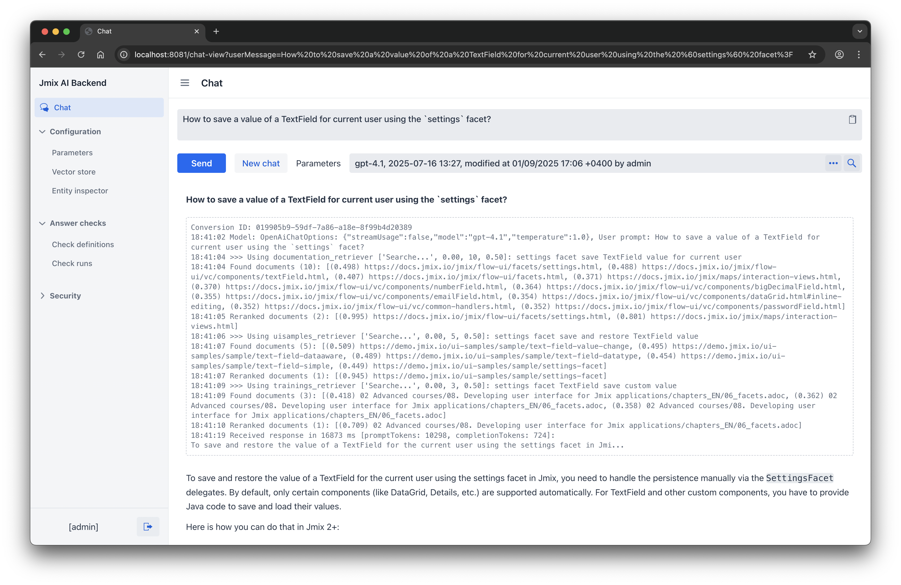

# Jmix AI Backend

AI-powered backend service designed to answer questions about the Jmix framework using Retrieval Augmented Generation (RAG). It's built with Spring AI and Jmix itself. 

The service provides a chat API and an admin UI for managing the knowledge base and LLM parameters. It integrates with OpenAI models, PgVector for vector storage, and includes custom reranking and answer validation logic.



## Architecture

The Jmix AI Backend system is designed to be used as a backend service for the Jmix AI Assistant, which provides web UI for users and an API for Jmix Studio.

However, Jmix AI Backend provides its own UI for administrators. 


The system consists of two main components:
- **Jmix AI Backend Application**: Jmix-based application with Spring AI integration
- **Reranker Service**: Python service for improving search result relevance


## Features

### Chat

It answers questions about the Jmix framework using Retrieval Augmented Generation (RAG). The chat is available through the API and the admin UI. 

The main chat functionality is implemented in the `ChatImpl` Spring bean. It makes three tools available to the LLM: `DocsTool`, `UiSamplesTool` and `TrainingsTool`. Each tool retrieves information from the vector store according to the LLM's requests.

After retrieving documents from the vector store, each tool filters them using a post-retrieval filtering algorithm and applies a reranking algorithm to the remaining documents. The reranked documents are then passed to the LLM.

The OpenAI API key should be defined in the `OPENAI_API_KEY` environment variable or otherwise provided in the `spring.ai.openai.api-key` application property.

### Post-retrieval filtering

The retrieved documents are filtered using a set of Groovy scripts that are applied to each document. The filtering is performed using the `PostRetrievalProcessor` class.

### Reranker

Python service for improving search result relevance. It uses a cross-encoder model to calculate the similarity between the question and the document. The similarity is then used to rank the documents.

The reranker source code is located in the `reranker` directory. The connection to the reranker service is specified in the `reranker.url` application property.

### Ingesters

Ingesters are used to import documents into the vector store. The application includes the following ingesters:
- `DocsIngester`: loads information from the Jmix documentation. This ingester is configured by the `docs.*` application properties.
- `UiSamplesIngester`: loads information from the Jmix UI Samples online application. This ingester is configured by the `uisamples.*` application properties.
- `TrainingsIngester`: loads information from the Jmix training courses. This ingester is configured by the `trainings.*` application properties. While the training courses content is not available to the public, you can provide your own set of AsciiDoc files.

All ingesters implement the `Ingester` interface and are invoked through the `IngesterManager` Spring bean.  

### Chat parameters

The chat parameters are stored in the database using the `Parameters` entity. They are used by the application through the `ParametersRepository` interface. 

The `Parameters` instance includes the YAML configuration that specifies parameters for the LLM, tools and post-retrieval filtering. You can create multiple instances of the `Parameters` entity and use them for different chat sessions to test different configurations. One instance should be marked as active to be used in the API calls. 

### Answer checks

This feature allows you to quickly validate AI response quality after changing the chat parameters. It uses two algorithms to calculate the similarity between the question and the answer:
- Groovy scripts. 
- LLM semantic score.

The semantic score is calculated in the backend application using OpenAI and controlled by `answer-checks.model` and `answer-checks.temperature` application properties.

## Chat API

The chat API available at `http://localhost:8081/chat` URL is the main entry point to the application functionality. It is provided by the `ChatController` class which delegates to the `Chat` interface implemented by `ChatImpl` Spring bean.

Example request:
```
POST /chat HTTP/1.1
Host: localhost:8081
Content-Type: application/json

{
    "conversation_id": "test-988979",
    "text": "How can I create a button that triggers a notification when clicked?",
    "cache_enabled": true
}
```

The `cache_enabled` property is currently not used.

## Admin UI

The admin UI is available at `http://localhost:8081` and provides the following features:

- **Chat** view. It allows you to send messages and view responses using any set of preconfigured parameters. The chat view continues a conversation with the LLM until you click "New chat".

- **Parameters** management. You can create multiple records and mark one of them as active. The active record is used to generate responses in the chat API. When you create a new record, it is populated with the default parameters loaded from the `io/jmix/ai/backend/init/default-params.yml` resource.
    
- **Vector store** management. This view shows the vector store contents and allows you to find documents by metadata, add, remove and update documents. If you click the "Update" button, the current record will be updated from its source. If you click one of the "Update" dropdown items, all relevant documents will be updated.

- **Answer checks**. The **Check definitions** view allows you to define questions and reference answers for validating the chat responses. The **Check runs** view allows you to run the set of checks for a particular parameters record and view the results. 

## Development

### Fast setup

You can run the main database, vector store and reranker using the `docker-compose.yml` file in the project root:

```bash
docker-compose up
```

By default, the application runs with the `dev` profile and uses the services running in the containers.

### Running services separately

Alternatively, you can run the services separately as follows.

Running PgVector:
```shell
docker run --name pgvector -p 15433:5432 -e POSTGRES_USER=postgres -e POSTGRES_PASSWORD=postgres pgvector/pgvector:pg17
```

Running reranker:
```shell
cd reranker
python3.10 -m venv env
source env/bin/activate
pip install fastapi==0.115.0 uvicorn==0.30.6 torch==2.4.1 transformers==4.44.2 pydantic==2.9.2

uvicorn reranker_service:app --host 0.0.0.0 --port 8000
```

## Building images

Build app image:
```shell
./gradlew bootBuildImage -Pvaadin.productionMode=true
```

Build reranker image:
```shell
cd reranker
python3.10 -m venv env
source env/bin/activate
pip install fastapi==0.115.0 uvicorn==0.30.6 torch==2.4.1 transformers==4.44.2 pydantic==2.9.2
docker build -t jmix-ai-reranker .
```
